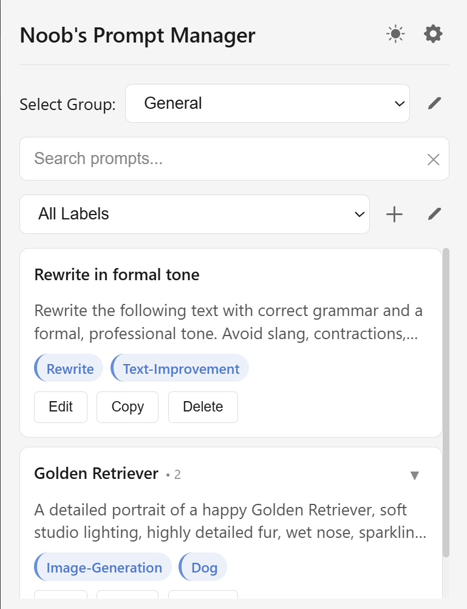

# Noob's Prompt Manager - Chrome Extension

A Chrome extension to save and manage AI prompts with groups and labels. 

## Quick Start

### Installation

1. Download the extension from the Chrome Web Store by clicking this link [Noob's Prompt Manager](https://google.com) **(Not available yet)**

2. Click "Add to Chrome" and confirm the installation.

OR

1. Download the latest zip file from this repository by clicking this link : [Link to release page](https://github.com/OneCodingNewbie/Noob-s-Prompt-Manager/releases).

2. Extract the zip file.
3. Open Chrome and go to `chrome://extensions/`. 
4. Enable "Developer mode" in the top right corner.
5. Click "Load unpacked" and select the extracted folder.

### Basic Usage

#### Right-click to Save Prompts

https://github.com/user-attachments/assets/65b336df-aa6d-44ce-8e14-af1b00de86d5

1. Select text on any webpage.
2. Right-click and choose "Noob's Prompt Manager" > "Save to Prompt Manager".
3. Confirm the details in the popup and click "Save Prompt".

> **Note**: If you want to append the last created prompt with the selected text, you could use the "Save to last entry" option in the right-click menu.

#### Pasting Prompts

https://github.com/user-attachments/assets/ee836831-6916-493a-903c-22e95890ae76

1. Click the textarea where you want to paste the prompt.
2. Open the extension popup by clicking the extension icon in the toolbar.
3. Select the prompt you want to paste from the list.

> **Note**: If the extension fails to paste the prompt directly into the textarea, the prompt will be copied to your clipboard, and you can paste it manually using `Ctrl + V` or `Cmd + V`.

## List of Features
- **Save Prompts**: Store your AI prompts in organized groups.
- **Right-Click Save**: Quickly save selected text from any webpage.
- **Groups**: Organize prompts into custom groups (default: General).
- **Segments**: Break down prompts into segments for better organization.
- **Labels**: Add labels to prompts for easy filtering.
- **Search**: Find prompts quickly with search functionality.
- **XSS Detection**: Prevents malicious codes from being saved or copied.
- **Export/Import**: Backup and restore your prompts.

## Required Permissions
This extension requires the following permissions:
- **Context Menus**: To add the right-click save option.
- **Storage**: To save prompts, groups, and labels locally in your browser.
- **Active Tab**: To access the selected text on the current webpage for saving prompts.
- **Clipboard Write**: To copy prompts to the clipboard for pasting.

## Privacy
All data is stored locally in your browser's storage. No data is sent to any server or third-party service. 

## License
This project is licensed under the MIT License. Anyone is free to use, modify, and distribute this software. See the [LICENSE.md](LICENSE.md) file for more details.
